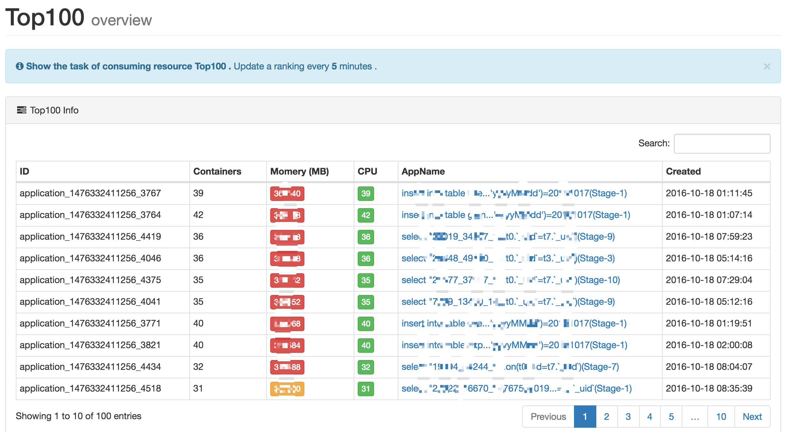
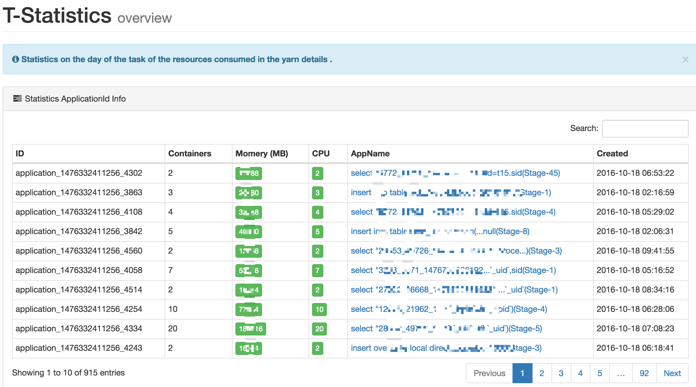

# Statistics

统计模块下，包含当天所有任务消耗的资源详情，以及消耗资源前 100 名（降序）的任务。

## Top100

展示前 100 名的资源消耗详情，如下图所示：



PS: 每个 ``` AppName ``` 都附带一个超链接，点击可查看完整 ``` SQL ```。

## T-Statistics

展示当天所有任务消耗资源详情，包含（Containers，Memory，CPU 等），如下图所示：



PS: 每个 ``` AppName ``` 都附带一个超链接，点击可查看完整 ``` SQL ```。

## MapReduce Counter

在统计的内存标签上，包含一个超链接，点击超链接可以跳转到 Map 和 Reduce 阶段的使用的内存详情，如下图所示：


