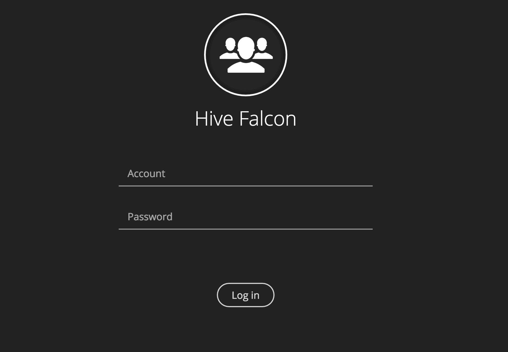
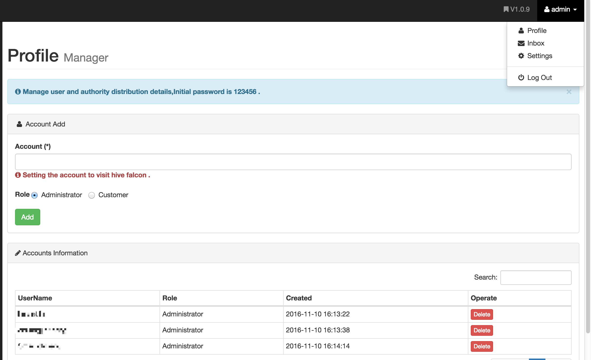
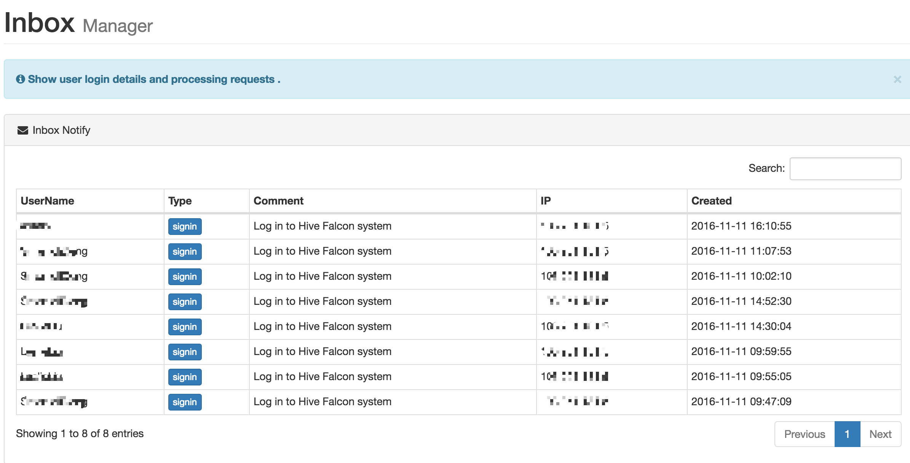
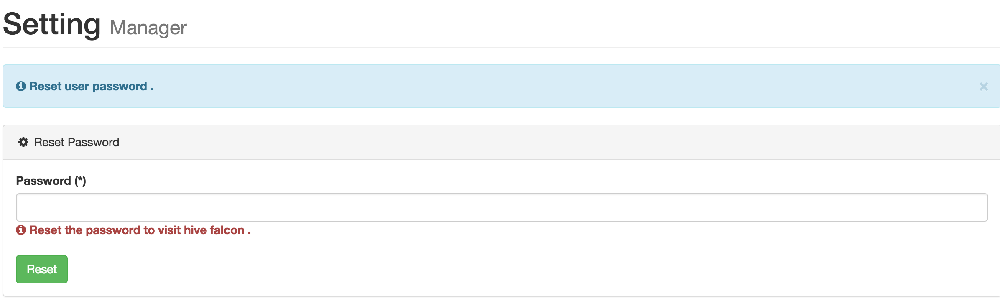

# Authorized
由于涉及对 Hive 表的 ```DML``` 操作，故给 ```Hive Falcon``` 添加了权限认证模块，现在进入系统需要有对应的账号和密码来访问 ```Hive Falcon```，由账号所拥有的权限来操作 ```Hive Falcon```，如下图所示：

## Login



## Profile

拥有管理员权限，可以访问 ```Profile``` 对成员进行管理（用户添加，权限分配，默认新增用户密码为：123456），以及对 ```Inbox``` 删除操作和登录的记录，如下图所示：



## Inbox

展示登录记录和删除记录，如下图所示：



## Setting

该模块用于修改当前用户的密码，如下图所示：


